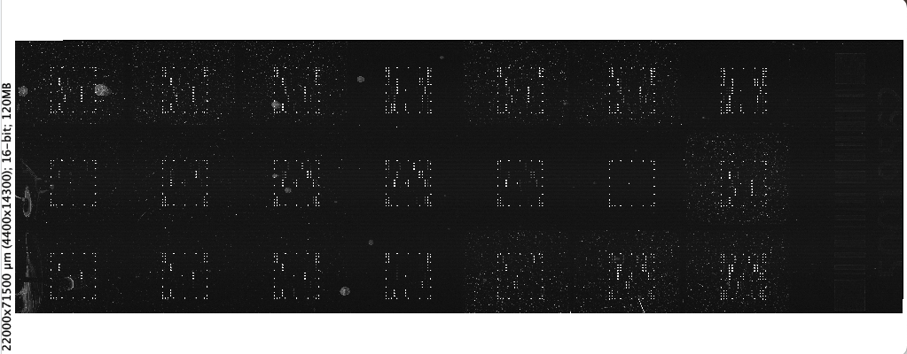
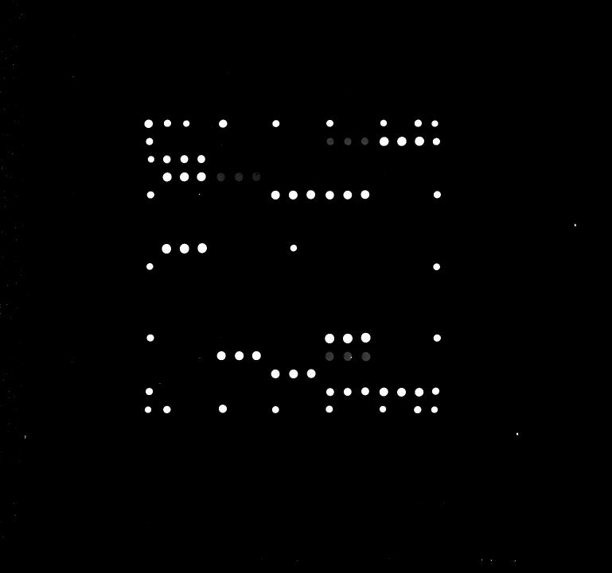
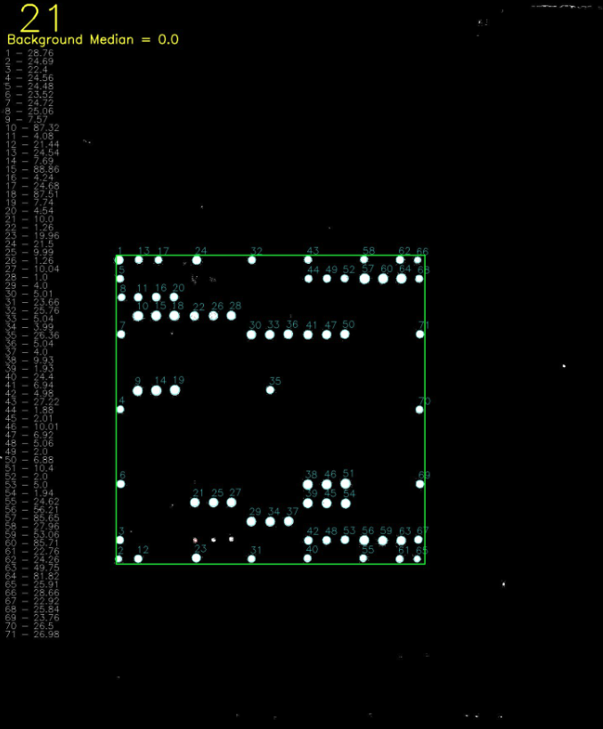

# Micro Array Processor
Streamlit App that take the input of a raw .tif image file from a slide scanner with 21 microarrays and processes them to output the intesities of the features using an input map and ID key to sort and average replicate features.

Below are example imaged of the raw .tif image file from the slide scanner, then one zoomed in well to show the mocro array and fianllay the processed microarray with the featured circles and picked out.
<table>
    <tr>
    <td style="text-align:center">Whole slide</td>
    <td style="text-align:center">One microarray</td>
    <td style="text-align:center">Processed microarray</td>
  </tr>
  <tr>
    <td>
      
    </td>
    <td>
      
    </td>
    <td>
      
    </td>
  </tr>
</table>

## App Overview
The app can be run from the command line with "streamlit run MicroArrayProcessor_StreamlitApp.py" which then open in a browser.
Processing steps are:
<ol>
    <li>There are some parameters that allow for some customization of the app (use the auto generated ones with the test images.</li>
    <li>Click the "Run Image Process" botton to start (script takes a few second to run).</li>
    <li>Reads the .tif file in using opencv (for tresholding, masking and controuing the features) as well as a numpy array for gathering the intesity values of the pixels).</li>
    <li>Splits the slide image into 24 wells (only use 21 since bottom 3 wells are always empty).</li>
    <li>Thresholds the microarray image so everyhting above the background * ratio_multiplier is set to 1 and everything below is 0.</li>
    <li>Labels all of the found features by drawing red circles around them.</li>
    <li>Finds the top left feature of the square/rectagular microarray using the expected height, width and pitch (distance between features) and performing a convolution of the 'expected' array map with the found array and setting the correct location to wherethe convolution is greatest.</li>
    <li>Draws a boundry of where the 'real' features are expected using the origin found. Then Label all of the features inside the expected boundry with cyan circles (shows the success or failure of the processign very easily).</li>
    <li>Creates an intermediate output .csv file with the raw data of the location in the array and the intesity found.</li>
    <li>Check that the gnerated images so that hte green rectagle is outlining all the microarrays.</li>
    <li>**Click the "Run Data Process** to finish the script.</li>
    <li>Reads back in the intermediate .csv file and use the map.csv and ID.csv files to determine the identity of each location in order to group and average the replicate featured together.</li>
    <li>Creates the final output file with the averaged and sorted data for the simple output of intesity per spot per well.</li>
</ol>

**Done!**

The provided images have been compressed for github to handle so the output intesities have been altered by the compression process but the code and output images and files still show a full piture of the app's capabilities.
